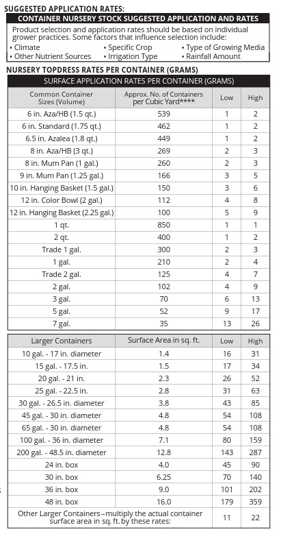

### Micro Max nutrient
This fertilizer may be applied to most plants. It comprises many nutrients. 

Ingredients specification: [Here](MicromaxMicronutrients.pdf) 

## 💡 Instruction
Included in the container is 1/2 Teaspoon scoop. Each scoop provides ~1.4 grams of Micromax.  

|  Usage |  Serving Size|
|---|---|---|---|
| 1-2 qt pot | 1-2 grams |
| 1 gal pot | 2-4 grams |
| 3 gal pot | 6-13 grams |
| 5 gal pot | 9-17 grams |

Application instructions: [Here](Micromax_Sheet.pdf)

